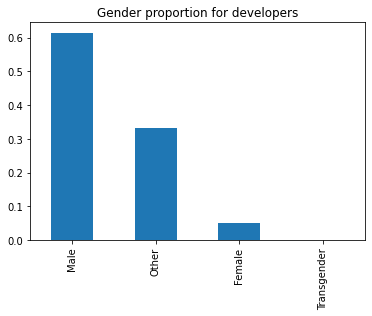
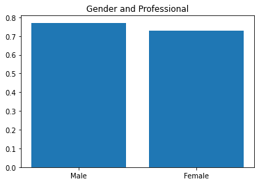
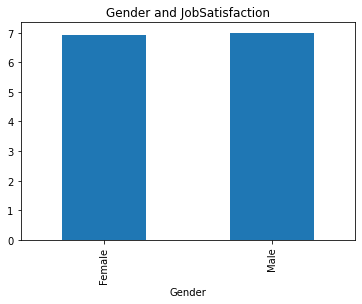
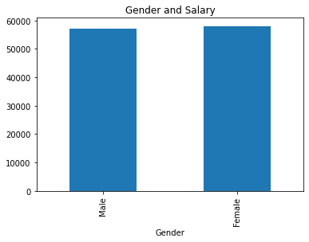

# Analyze developer characteristics based on gender
# StackoverflowSurveyInsight

StackoverflowSurveyInsight is data analysis Project, this project was built with the aim of finding answers to the question: Is there a gender balance for developer characteristics?

## Data

We used dataset: [Stack Overflow Data - 2017 Survey](https://www.kaggle.com/stackoverflow/so-survey-2017)

## Step

### Business Understanding

We will try to answer 4 questions, include:

1. What is the gender proportion for developers?
2. Are there professional differences between men and women?
3. As a developer, are women as satisfied with their jobs as men?
4. How does gender affect salary?

### Data Understanding
#### About Dataset
Every year, Stack Overflow conducts a massive survey of people on the site, covering all sorts of information like programming languages, salary, code style and various other information. This year, they amassed more than 64,000 responses fielded from 213 countries.

#### Data
The data is made up of two files:
- survey_results_public.csv - CSV file with main survey results, one respondent per row and one column per answer
- survey_results_schema.csv - CSV file with survey schema, i.e., the questions that correspond to each column name

### Prepare Data
#### Usage data section
We use the list of 5 cols in the dataset to find insight : [`Professional`, `ProgramHobby`, `JobSatisfaction`, `Salary`, `Gender`]

#### Preprocessing Data

1. **`Gender`** We have 30 categories for gender. We need custom gender to Male, Female, Transgender, Other with following rules:
  - `Male` for records only contain `Male`
  - `Female` for records only contain `Female`
  - `Transgender` for records contain `Transgender`
  - `Other` for the rest

2. **`Professional`** not change

3. **`ProgramHobby`** not change

4. **`JobSatisfaction`** Drop Null values. When Used to answer question number 3  

5. **`Salary`** Drop Null values. When Used to answer question number 4

### Analysis and results
1. What is the gender proportion for developers?
2. 

2. Are there professional differences between men and women?

3. As a developer, are women as satisfied with their jobs as men?

4. How does gender affect salary?

### Summary

> With the questions asked, we can conclude that becoming a developer is a very picky field for women. There are very few women becoming developers. However, the capacity of female developers is very high, and their remuneration is also commensurate.

### Discuss

> The next question is whether the number of female developers will increase in the future? and with their capabilities, how can we attract more women to become developers? Please comment on this.

## License
[MIT](https://github.com/lexuansanh)